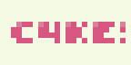

<div align="center">

  
  <h3>Chess 4K Engine</h3>

  [![License][badge-license]][link-license]

</div>

## Overview
A c++ chess engine that fits into 4KiB

It supports the following subset of the UCI protocol:
- `uci`
- `isready`
- `position startpos moves ...`
- `go wtime ... btime ...`
- `quit`

Additional support for non-4k builds:
- `ucinewgame`
- `position fen ... moves ...`

The first message is always regarded as `uci` due to the space restriction

## Building
Building c4ke requires `g++` that supports `c++20`:
```
git clone https://github.com/citrus610/c4ke
cd c4ke
make c4ke
```
To build c4ke-mini on Linux, run:
```
make c4ke-mini
```

## Minification
The minifier isn't general purpose and won't work on all c++ code
- Removing whitespaces
- Removing single-line comments
- Removing `#ifdef` blocks (usually for OpenBench compliance code)
- Finding and replacing `#define` constants
- Renaming identifiers

## Features
### Board representation
- Bitboard
- 8x8 Mailbox
- Dumb7Fill move generation
### Search
- Iterative deepening
- Aspiration windows
- Lazy SMP
- Principal variation search
- Quiescence search
  - Check evasions
- Transposition table
- Move ordering
  - TT move
  - MVV-LVA
  - Quiet history
  - Noisy history
  - Continuation history
    - 1-ply
    - 2-ply
  - Static exchange evaluation
- Selectivity
  - Pruning
    - Reverse futility pruning
    - Null move pruning
    - Late move pruning
    - Futility pruning
    - PVS SEE pruning
    - QS SEE pruning
  - Extensions
    - Singular extensions
      - Double extensions
      - Multicut
  - Reductions
    - Internal iterative reductions
    - Late move reductions
- Static evaluation correction history
  - Pawn correction history
  - Non-pawn correction history
  - Continuation correction history
    - 1-ply
    - 2-ply
### Evaluation
- Material
- Rank/file piece-square tables
- Bishop pair
- Mobility
- Tempo
- Rook on open file
- Rook on semi-open file
- Pawn threats
- Pawn structure
  - Protected pawn
  - Doubled pawn
  - Passed pawn
  - Blocked passed pawn
  - Pawn phalanx
- King safety
  - King on open file
  - King on semi-open file
  - Pawn shield
  - King ring attack

## Thanks
- Members of the MinusKelvin discord server
- The following engines that I use as references:
  - [ice4](https://github.com/MinusKelvin/ice4)
  - [4ku](https://github.com/kz04px/4ku)

[badge-license]: https://img.shields.io/github/license/citrus610/c4ke?style=for-the-badge&label=license&color=success
[badge-release]: https://img.shields.io/github/v/release/citrus610/c4ke?style=for-the-badge&label=official%20release
[badge-commits]: https://img.shields.io/github/commits-since/citrus610/c4ke/latest?style=for-the-badge

[link-license]: LICENSE
[link-release]: https://github.com/citrus610/c4ke/releases/latest
[link-commits]: https://github.com/citrus610/c4ke/commits/main
